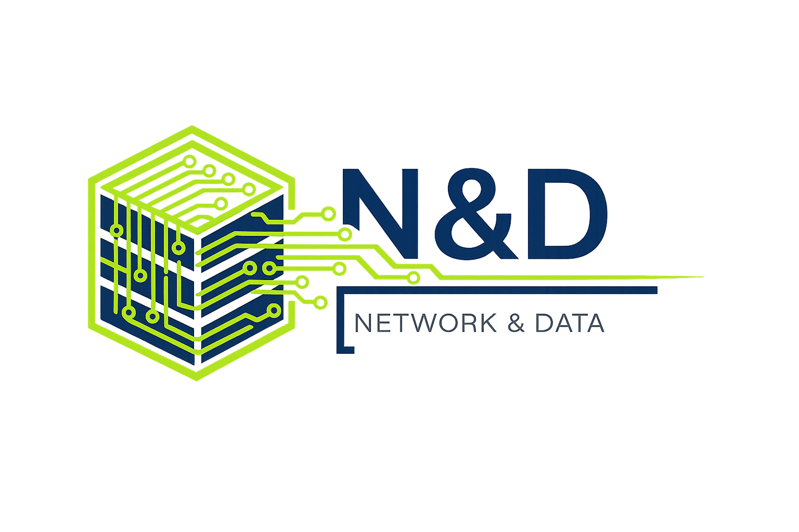
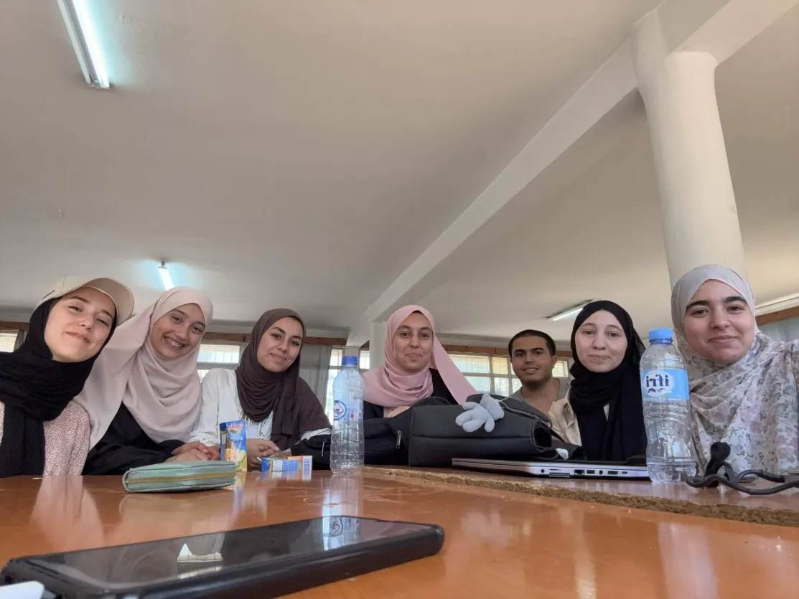

# Rénovation de l'Architecture Réseau du Data Center de l'ESI
### Du modèle 3-Tier vers une fabrique Leaf-Spine basée sur VXLAN / BGP EVPN

*Projet 2CS — Cycle Supérieur — École nationale supérieure d'informatique (ESI), Algiers*

---

## 📖 Overview

The ESI data center currently relies on a classic **3-Tier architecture** (Core / Distribution / Access), governed by Spanning Tree and VLANs. As AI workloads, cloud platforms, student TP/project environments, and pedagogical services grew, this east-west-heavy traffic pattern started to hit the limits of a design built for north-south flows.

This project proposes and validates — inside a full **EVE-NG lab** — a modern **Leaf-Spine fabric** with a clean separation between:

- **Underlay** — a routed IP transport layer (eBGP Multi-AS + ECMP) guaranteeing redundant, low-latency connectivity between all Spines and Leafs.
- **Overlay** — a logical layer built on **VXLAN** and **BGP EVPN**, providing isolated, multi-tenant virtual networks (VNIs) without flood-and-learn.

The result is a scalable, highly-available, and security-hardened data center design, complete with a DMZ, dual firewalls, an SSH bastion, an HTTPS reverse proxy, and QoS policies tuned for GPU/AI, backup, and high-traffic enrollment periods.

## 🏗️ Architecture at a Glance

| Layer | Design Choice | Purpose |
|---|---|---|
| **Topology** | 2 Spines + 3 Leafs (full-mesh) | Predictable 2-hop latency, horizontal scalability |
| **Underlay routing** | eBGP Multi-AS + ECMP | Redundancy across both Spine paths, fast failover |
| **Overlay** | VXLAN + BGP EVPN | 16M logical segments, no multicast/flood-and-learn |
| **Segmentation** | 4 VRFs / VNIs (Bacheliers, TP & Projects, GPU/Cloud, Infra) | Multi-tenant isolation with controlled route leaking |
| **Perimeter security** | Dual firewall + DMZ + VM-gateway (bastion SSH + HTTPS reverse proxy) | Zero direct exposure of internal servers |
| **QoS** | DSCP marking, LLQ, WFQ, policing/shaping | Prioritizes GPU/AI and enrollment traffic without starving backups |

Validated in the lab with Cisco ASAv firewalls, Cisco routers, and Arista vEOS switches — including live ECMP failover tests captured with Wireshark.

## 📂 Repository Contents

| File | Description |
|---|---|
| [`docs/article-equipe-06.pdf`](docs/article-equipe-06.pdf) | Full technical report — architecture, lab setup, ECMP validation, VRF segmentation, external access, firewall rules, QoS |
| [`docs/poster-1-equipe-6.pdf`](docs/poster-1-equipe-6.pdf) | Poster 1 — Theoretical study on Data Centers (3-Tier vs Spine-Leaf, Underlay/Overlay fundamentals, vendor comparison) |
| [`docs/poster-2-equipe-6.pdf`](docs/poster-2-equipe-6.pdf) | Poster 2 — Needs analysis & proposed architecture (existing ESI infrastructure, proposed Underlay/Overlay design) |
| `assets/` | Team logo and photo |

## 👥 Team — Network & Data (Team 06)

- Chattah Salsabila
- Marmouze Norelhouda
- Bouderbala Amira
- Saidi Selma Ikram
- Chouider Djoghlal Romaisa
- Reda Allouche

**Supervisors:** Hammani Nacer, Amrouche Hakim
**Institution:** École nationale supérieure d'informatique (ESI), Algiers, Algeria — 2026

## 🔑 Key Takeaways

- Full-mesh Leaf-Spine with ECMP keeps **all links active** — no STP-blocked paths, immediate failover verified live in EVE-NG.
- **BGP EVPN** eliminates VXLAN's native flood-and-learn, giving proactive MAC/IP distribution across all VTEPs.
- A **multi-VNI backup server** (present in two VXLANs at once) backs up two segments without breaking isolation.
- Defense-in-depth external access: router NAT → Firewall 1 → DMZ → VM-gateway (bastion SSH + Nginx reverse proxy with an internal PKI) → Firewall 2 → internal fabric.
- QoS dynamically reprioritizes traffic during peak enrollment periods without degrading GPU/AI or TP workloads.

---

Built with EVE-NG, Cisco ASAv/IOS, and Arista vEOS · 2CS Networking Project · ESI 2026

